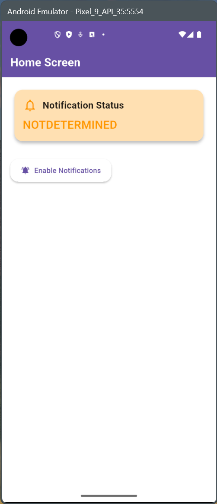
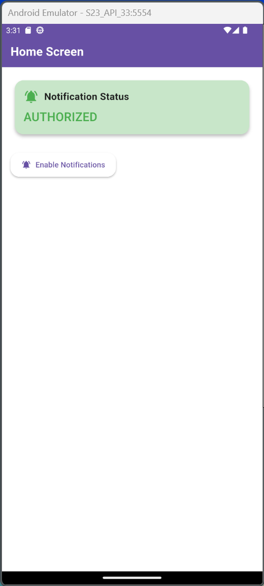
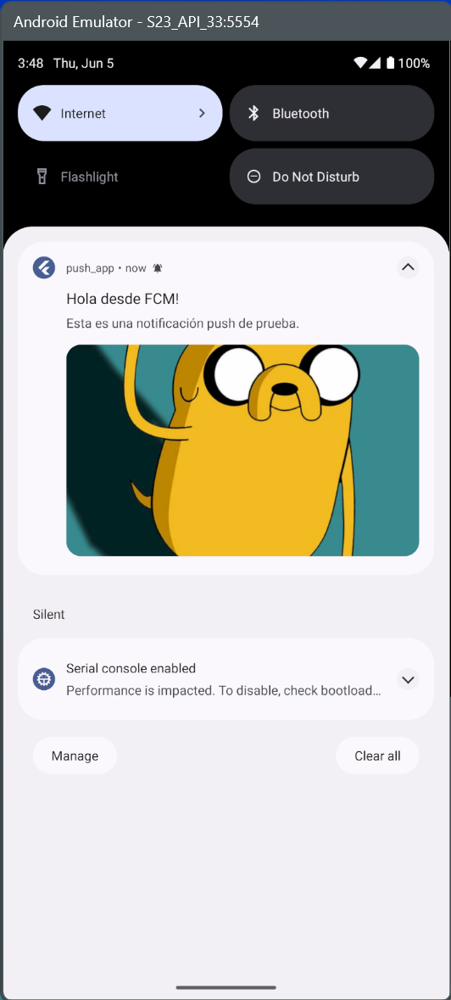
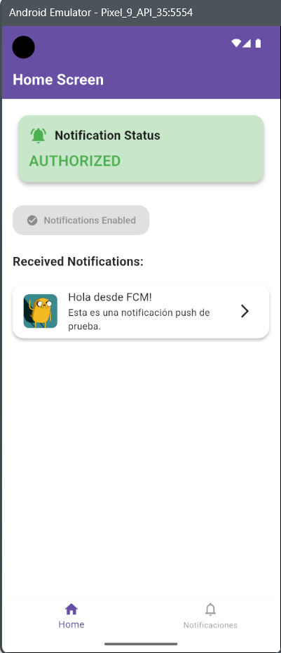
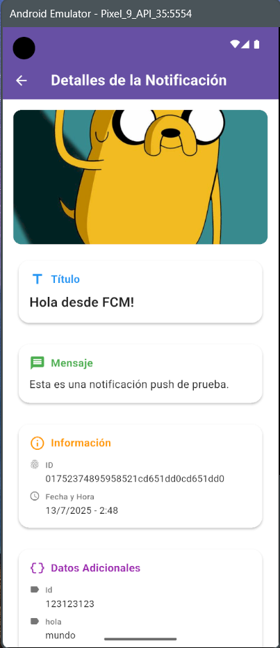
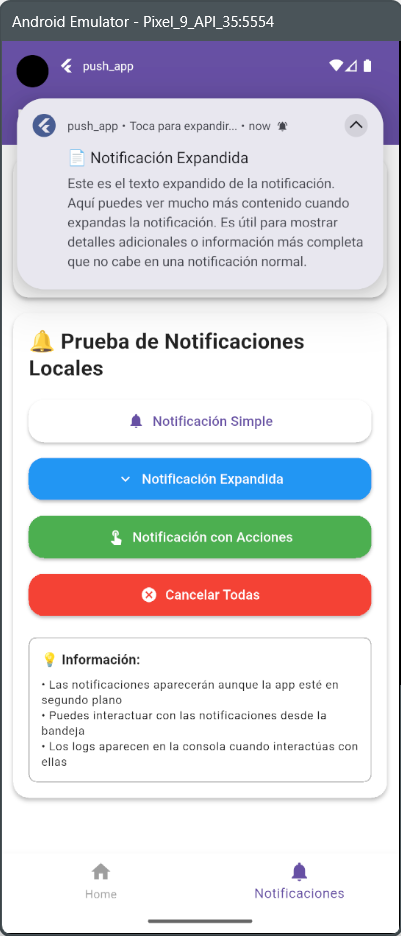

# Push App

Una aplicación Flutter completa para demostrar la implementación de notificaciones push usando Firebase Cloud Messaging (FCM) y notificaciones locales.

## 📱 Vista Previa de la Aplicación

<div align="left">
  
  
  
  
  
  
</div>

## 🚀 Características Implementadas

- ✅ **Firebase Cloud Messaging (FCM)** - Notificaciones push desde la nube
- ✅ **Notificaciones Locales** - Notificaciones generadas en el dispositivo
- ✅ **Gestión de Estados con Bloc** - Manejo eficiente del estado de notificaciones
- ✅ **Navegación con GoRouter** - Navegación moderna y declarativa
- ✅ **Detalles de Notificaciones** - Pantalla dedicada para ver información completa
- ✅ **Manejo de Interacciones** - Navegación automática al tocar notificaciones
- ✅ **Diferentes Tipos de Notificaciones** - Simple, expandida y con acciones
- ✅ **Tema Personalizado** - UI moderna con Material Design 3

## 📩 1. Firebase Messaging

Firebase Cloud Messaging (FCM) es un servicio de Google que permite enviar notificaciones push de forma confiable y eficiente a dispositivos móviles y aplicaciones web.

[](https://www.youtube.com/watch?v=sioEY4tWmLI)

**Recursos oficiales:**

- Conoce Firebase para Flutter: <https://firebase.flutter.dev/docs/overview>
- Firebase Cloud Messaging: <https://firebase.flutter.dev/docs/messaging/overview>
- Guía de implementación: <https://firebase.flutter.dev/docs/messaging/usage>

## 🔧 2. Firebase CLI

Firebase Command Line Interface (CLI) es una herramienta que proporciona comandos para administrar y desplegar aplicaciones y recursos de Firebase desde la línea de comandos.

### 2.1 Instalación

Documentación: <https://firebase.google.com/docs/cli?hl=es-419>

```bash
# Instalar con node
npm install -g firebase-tools

# Iniciar sesión en Firebase
firebase login

# Inicializar Firebase en tu proyecto
firebase init

# Listar tus proyectos de Firebase
firebase projects:list

# Desplegar tu aplicación
firebase deploy
```

### 2.2 Configurar Firebase en el proyecto de Flutter

**⚠️ Requisitos previos:**

- Proyecto Flutter creado
- Cuenta de Firebase activa
- Firebase CLI instalado

```sh
# 1. Ubicarse en la carpeta del proyecto
cd push_app

# 2. Instalar FlutterFire CLI globalmente
dart pub global activate flutterfire_cli

# 3. Configurar Firebase (selecciona proyecto y plataformas)
flutterfire configure

# 4. Agregar dependencias necesarias al pubspec.yaml
flutter pub add firebase_core firebase_messaging flutter_local_notifications
```

### 2.3 Inicialización en el código

Después de la configuración, inicializa Firebase en tu aplicación:

```dart
// main.dart
import 'package:firebase_core/firebase_core.dart';
import 'firebase_options.dart';

void main() async {
  WidgetsFlutterBinding.ensureInitialized();
  await Firebase.initializeApp(
    options: DefaultFirebaseOptions.currentPlatform,
  );
  runApp(MyApp());
}
```

## 🔔 3. Notificaciones push

Las notificaciones push son mensajes que se envían desde un servidor a dispositivos específicos, permitiendo interactuar con usuarios incluso cuando la aplicación no está abierta.

### 3.1 Arquitectura de la aplicación

Esta aplicación implementa una arquitectura robusta para manejar notificaciones:

- **NotificationsBloc**: Maneja el estado global de las notificaciones usando BlocPattern
- **Firebase Messaging Handler**: Procesa mensajes en segundo plano
- **Local Notifications Service**: Gestiona notificaciones locales con diferentes tipos
- **Notification Interaction Handler**: Maneja la navegación cuando se toca una notificación
- **GoRouter**: Navegación declarativa con rutas tipadas

### 3.2 Tipos de notificaciones implementadas

#### 📱 Notificaciones Push (Firebase FCM)

- Recepción en primer plano, segundo plano y app cerrada
- Manejo automático de datos adicionales (payload)
- Navegación automática a pantalla de detalles
- Almacenamiento en el estado de la aplicación

#### 🔔 Notificaciones Locales

- **Simple**: Notificación básica con título y cuerpo
- **Expandida**: Con texto largo que se expande al tocar
- **Con Acciones**: Incluye botones de "Aceptar" y "Rechazar"
- **Programadas**: Para envío diferido (funcionalidad base implementada)

### 3.3 Plataformas para enviar notificaciones push

- **Firebase Cloud Messaging (FCM):** Solución gratuita de Google. Permite enviar notificaciones a Android, iOS y web. Ofrece consola visual para envíos manuales o API para automatización

- **OneSignal:** Plataforma especializada en notificaciones. Interfaz amigable y potentes analíticas. Plan gratuito con límites y planes pagos

- **Amazon SNS:** Servicio de AWS para notificaciones. Escalable para aplicaciones grandes. Integración con otros servicios de AWS

- **Pusher:** Plataforma de comunicación en tiempo real. Buena para aplicaciones que requieren interacción inmediata

### 🔥 3.4 Firebase Console

Para enviar notificaciones push a dispositivos Android desde Firebase Console:

1. **Accede a Firebase Console**: Ve a <https://console.firebase.google.com/> e inicia sesión

2. **Selecciona tu proyecto**: Haz clic en el proyecto donde tienes configurada tu app Flutter

3. **Navega a Cloud Messaging**: Selecciona el menú de `Ejecución > Messaging`

4. **Crea una notificación**:
   - Haz clic en `Crear tu primera campaña`
   - Selecciona `Mensajes de Firebase Notifications` como tipo de campaña

5. **Configura la notificación**:
   - Llenar los datos del formulario
   - En destinararios, elige "App" para enviar a toda la app. O usa segmentación por temas o tokens específicos
   - Configura cuándo enviar la notificación
   - Revisa los detalles y haz clic en "Publicar"
   - Monitorea los informes de entrega en la sección "Reporting"

## ⛑️ 4. Dependencias principales

Este proyecto utiliza las siguientes dependencias clave:

```yaml
dependencies:
  firebase_core: ^3.13.1              # SDK base de Firebase
  firebase_messaging: ^15.2.6         # Mensajería push de Firebase
  flutter_local_notifications: ^19.3.0 # Notificaciones locales
  flutter_bloc: ^9.1.1                # Gestión de estado con Bloc
  go_router: ^15.1.2                  # Navegación declarativa
  equatable: ^2.0.7                   # Comparación de objetos
```

## 🏗️ 5. Arquitectura del proyecto

### 5.1 Estructura de carpetas

```txt
lib/
├── config/
│   ├── handlers/                    # Manejadores de eventos
│   │   ├── firebase_messaging_handler.dart
│   │   └── notification_interaction_handler.dart
│   ├── helpers/                     # Utilidades
│   │   └── message_utils.dart
│   ├── router/                      # Configuración de rutas
│   │   └── app_router.dart
│   ├── services/                    # Servicios de la aplicación
│   │   └── local_notifications_service.dart
│   └── theme/                       # Tema de la aplicación
│       └── app_theme.dart
├── domain/
│   └── entities/                    # Entidades del dominio
│       └── push_message.dart
└── features/                        # Características por módulos
    ├── home/
    │   ├── blocs/                   # Lógica de negocio con Bloc
    │   └── screens/                 # Pantallas
    ├── local_notifications/
    │   ├── screens/
    │   └── widgets/
    └── navigation/
        └── widgets/
```

### 5.2 Flujo de notificaciones

1. **Inicialización**: Se configura Firebase y el servicio de notificaciones locales
2. **Permisos**: Se solicitan permisos al usuario para mostrar notificaciones
3. **Token FCM**: Se obtiene y registra el token único del dispositivo
4. **Recepción**: Los mensajes se manejan según el estado de la app:
   - **Foreground**: Se procesan inmediatamente y se muestran como notificaciones locales
   - **Background**: Se procesan en segundo plano
   - **Terminated**: Se almacenan para procesar al abrir la app
5. **Interacción**: Al tocar una notificación, se navega automáticamente a los detalles

## ⛑️ 6. Ayuda

### 🗺️ 6.1 Guías

**Comillas simples en vez de dobles:**

Abrir el archivo de `analysis_options.yaml` y establecer la siguiente configuración:

```yaml
include: package:flutter_lints/flutter.yaml

linter:
  rules:
    prefer_single_quotes: true # Aquí se habilita
```

Para aplicar y verificar:

```bash
# Analizar el código y ver los problemas encontrados por el linter
flutter analyze

# Corregir automáticamente las correcciones sugeridas (ej: Comillas simples por dobles)
dart fix --apply
```

### ⌨️ 6.2 Comandos útiles

```bash
# Instalar los paquetes o dependencias
flutter pub get

# Compilar y ejecutar la aplicación en un dispositivo conectado o emulador
flutter run
```

```bash
# Limpiar temporales
flutter clean

# Ejecutar el doctor para validar si todo está correcto
flutter doctor
```
